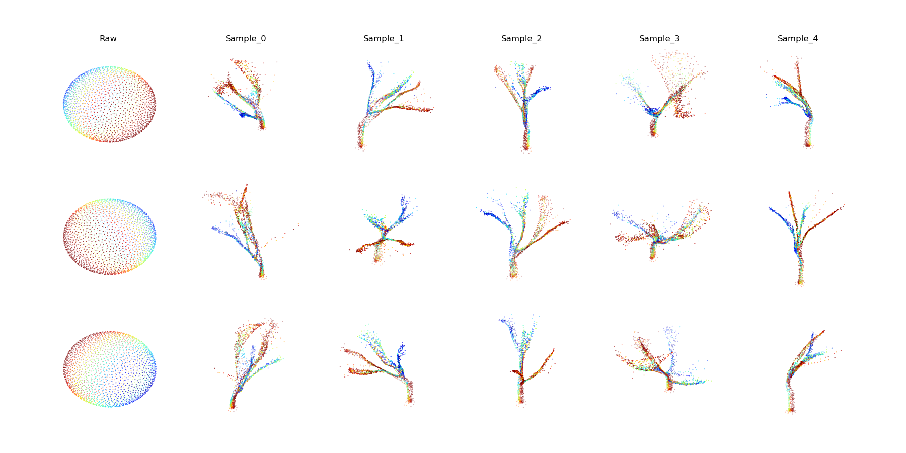
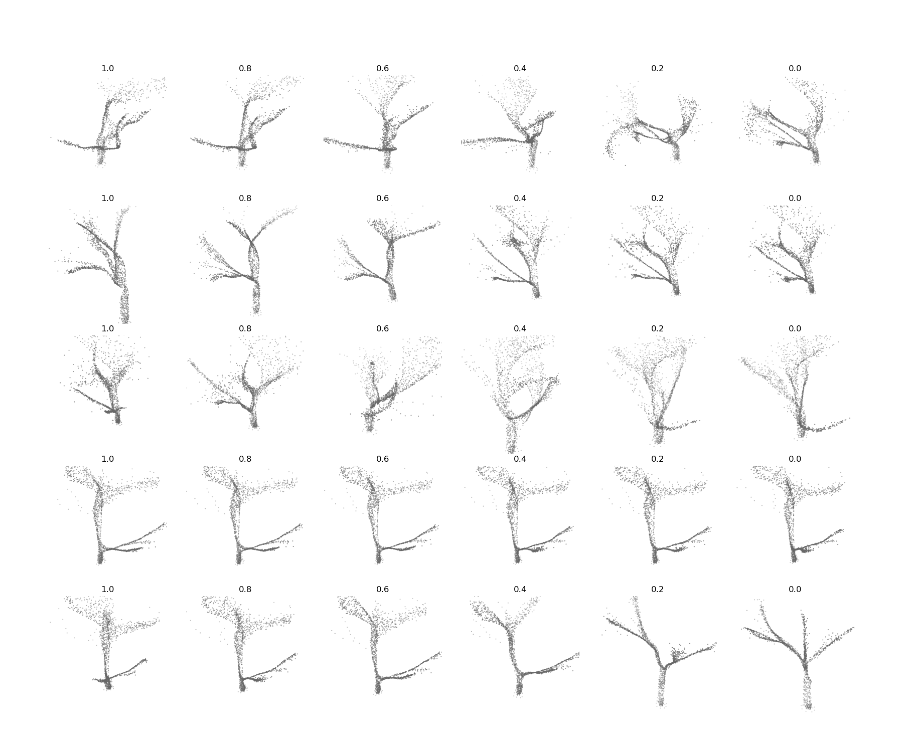

# Tree Generation with SP-GAN

Project procedurally generates trees and trains [SP-GAN](https://github.com/liruihui/SP-GAN) to generate them. 

Refer to original [README](use_README.md) for model usage

### Procedural Tree Generation

Trees were procedurally generated with this [blender addon](https://github.com/friggog/tree-gen) 

See the scripts in dataset_generation for dataset creation. generate_tree_dataset.py is a blender script to export the tree meshes and convert_dataset.py will convert them to pointclouds. 

Two datasets were generated. One only uses the acer tree preset in the blender addon and the other uses all 20 preset types. They are available [here](https://drive.google.com/drive/folders/1S04UFQLdYFiSpF6lmIk__AftQh0zDD2l?usp=sharing)

### Training and Results

Two models were trained for 300 epochs. Some results are shown below. For training graphs and more examples see [results](results/plots). The pretrained models can be found [here](https://drive.google.com/drive/folders/1aTxPGRIRphNG5qH-wf_9NpGR3WGPgN0k?usp=sharing)

#### Acer

#### All 20 Trees
